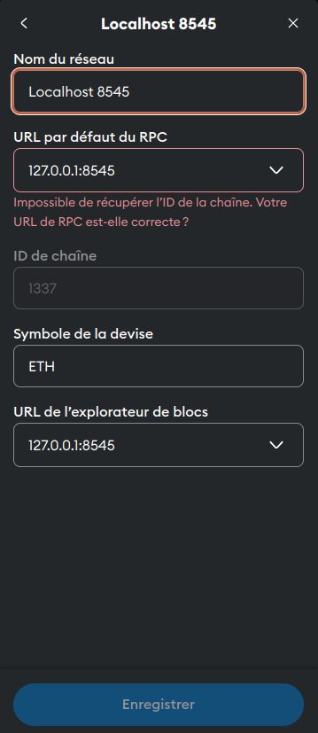
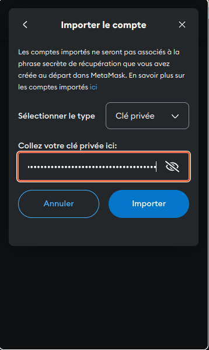

# Documentation : Configurer MetaMask pour se connecter à un réseau RedHat local

Cette documentation explique comment configurer **MetaMask** pour se connecter à un réseau **RedHat local** simulé avec **Hardhat**. Vous apprendrez à configurer MetaMask pour interagir avec un nœud blockchain local, ce qui est essentiel pour tester des Smart Contracts ou des applications décentralisées (dApps) dans un environnement de développement.

---

## Introduction à MetaMask et RedHat

### **MetaMask**
MetaMask est un portefeuille Ethereum populaire qui permet aux utilisateurs de gérer leurs comptes Ethereum, d'interagir avec des applications décentralisées (dApps) et d'effectuer des transactions sur la blockchain. Il est disponible en tant qu'extension de navigateur (pour Chrome, Firefox, Brave, etc.) et en tant qu'application mobile. MetaMask agit comme une interface entre l'utilisateur et la blockchain, facilitant la gestion des clés privées, la signature des transactions et la connexion à différents réseaux Ethereum.

### **RedHat**
RedHat est un système d'exploitation basé sur Linux, largement utilisé dans les environnements professionnels pour sa stabilité et sa sécurité. Dans ce contexte, "RedHat local" fait référence à un environnement de développement local configuré pour simuler un réseau blockchain. Hardhat, un framework de développement Ethereum, est utilisé pour créer et gérer ce réseau local. Hardhat permet de déployer des Smart Contracts, d'exécuter des tests et de simuler des transactions dans un environnement isolé.

---

## Prérequis

Avant de commencer, assurez-vous d'avoir les éléments suivants :
1. **Hardhat** installé sur votre machine.
2. Un projet Hardhat configuré avec un nœud local en cours d'exécution.
3. **MetaMask** installé dans votre navigateur (Firefox, Chrome ou Brave).
4. Une connexion internet stable.

---

## Étapes pour configurer MetaMask avec un réseau RedHat local

### 1. Lancer un nœud local avec Hardhat

1. **Initialiser Hardhat (si ce n'est pas déjà fait) :**
   - Ouvrez un terminal et exécutez la commande suivante pour initialiser un projet Hardhat :
     ```bash
     npx hardhat init
     ```
   - Suivez les instructions pour configurer votre projet.

2. **Démarrer un nœud local :**
   - Dans le terminal, exécutez la commande suivante pour lancer un nœud local :
     ```bash
     npx hardhat node
     ```
   - Hardhat démarrera un nœud local qui écoute sur `http://127.0.0.1:8545`. Vous verrez une liste de comptes générés avec leurs adresses et clés privées.

   **Exemple de sortie :**
   ```
   Started HTTP and WebSocket JSON-RPC server at http://127.0.0.1:8545/

   Accounts
   ========

   Account #0: 0xf39Fd6e51aad88F6F4ce6aB8827279cffFb92266 (10000 ETH)
   Private Key: 0xac0974bec39a17e36ba4a6b4d238ff944bacb478cbed5efcae784d7bf4f2ff80

   Account #1: 0x70997970C51812dc3A010C7d01b50e0d17dc79C8 (10000 ETH)
   Private Key: 0x59c6995e998f97a5a0044966f0945389dc9e86dae88c7a8412f4603b6b78690d
   ```

   Gardez ce terminal ouvert, car il exécute votre nœud local.

---

### 2. Configurer MetaMask pour se connecter au réseau RedHat local

1. **Ouvrir MetaMask :**
   - Cliquez sur l'icône MetaMask dans la barre d'outils de votre navigateur pour ouvrir l'extension.

2. **Ajouter un réseau personnalisé :**
   - En haut de l'interface MetaMask, cliquez sur le nom du réseau actuel (par défaut, "Ethereum Mainnet").
   - Sélectionnez **"Add Network"** dans le menu déroulant.

3. **Remplir les détails du réseau RedHat local :**
   - Dans le formulaire qui s'affiche, entrez les informations suivantes :
     - **Nom du réseau** : RedHat Local
     - **Nouvelle URL RPC** : `http://127.0.0.1:8545`
     - **ID de chaîne** : `31337` (l'ID de chaîne par défaut pour Hardhat)
     - **Symbole de la devise** : ETH
     - **URL de l'explorateur de blocs** : Laissez ce champ vide (ou utilisez un explorateur local si disponible).

   - Cliquez sur **"Save"** pour enregistrer le réseau.

   

4. **Vérifier la connexion :**
   - Une fois le réseau ajouté, MetaMask basculera automatiquement sur le réseau "RedHat Local".
   - Vous devriez voir le solde de votre compte principal (0 ETH par défaut, sauf si vous avez importé un compte avec des fonds).

---

### 3. Importer un compte RedHat local dans MetaMask

Pour interagir avec votre réseau RedHat local, vous devez importer un compte généré par Hardhat dans MetaMask.

1. **Récupérer la clé privée d'un compte :**
   - Dans le terminal où Hardhat est en cours d'exécution, repérez un compte et sa clé privée (voir la sortie du nœud Hardhat).
   - Exemple :
     ```
     Account #0: 0xf39Fd6e51aad88F6F4ce6aB8827279cffFb92266 (10000 ETH)
     Private Key: 0xac0974bec39a17e36ba4a6b4d238ff944bacb478cbed5efcae784d7bf4f2ff80
     ```

2. **Importer le compte dans MetaMask :**
   - Dans MetaMask, cliquez sur l'icône de profil en haut à droite.
   - Sélectionnez **"Import Account"**.
   - Choisissez **"Private Key"** comme type d'importation.
   - Collez la clé privée du compte RedHat local dans le champ prévu.
   - Cliquez sur **"Import"**.

   

3. **Vérifier le compte importé :**
   - Une fois importé, le compte apparaîtra dans MetaMask avec son solde initial (10 000 ETH par défaut pour les comptes Hardhat).

---

### 4. Tester la connexion

1. **Vérifier le solde :**
   - Assurez-vous que le solde du compte importé est correct (10 000 ETH par défaut).

2. **Envoyer une transaction :**
   - Cliquez sur **"Send"** dans MetaMask.
   - Entrez l'adresse d'un autre compte généré par Hardhat (par exemple, `0x70997970C51812dc3A010C7d01b50e0d17dc79C8`).
   - Définissez un montant (par exemple, 1 ETH) et validez la transaction.

3. **Vérifier la transaction :**
   - Dans le terminal où Hardhat est en cours d'exécution, vous verrez les logs de la transaction confirmant qu'elle a été traitée avec succès.

---

## Conclusion

Vous avez maintenant configuré MetaMask pour interagir avec un réseau RedHat local simulé par Hardhat. Cela vous permet de tester des Smart Contracts et des dApps dans un environnement de développement sécurisé et isolé. Vous pouvez répéter ces étapes pour configurer d'autres réseaux locaux ou personnalisés selon vos besoins.

Pour aller plus loin, explorez la documentation officielle de [MetaMask](https://metamask.io/faq.html) et de [Hardhat](https://hardhat.org/docs).

---