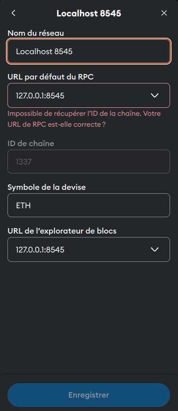

   # Documentation: Configure MetaMask to Connect to a Local RedHat Network

   This documentation explains how to configure **MetaMask** to connect to a **RedHat local network** simulated with **Hardhat**. You will learn how to set up MetaMask to interact with a local blockchain node, which is essential for testing Smart Contracts or decentralized applications (dApps) in a development environment.

   [Version en Français](./README.md)

   ---

   ## Introduction to MetaMask and RedHat

   ### **MetaMask**
   MetaMask is a popular Ethereum wallet that allows users to manage their Ethereum accounts, interact with decentralized applications (dApps), and perform transactions on the blockchain. It is available as a browser extension (for Chrome, Firefox, Brave, etc.) and as a mobile app. MetaMask acts as an interface between the user and the blockchain, facilitating private key management, transaction signing, and connection to different Ethereum networks.

   ### **RedHat**
   RedHat is a Linux-based operating system widely used in professional environments for its stability and security. In this context, "RedHat local" refers to a local development environment configured to simulate a blockchain network. Hardhat, an Ethereum development framework, is used to create and manage this local network. Hardhat allows deploying Smart Contracts, running tests, and simulating transactions in an isolated environment.

   ---

   ## Prerequisites

   Before starting, ensure you have the following:
   1. **Hardhat** installed on your machine.
   2. A Hardhat project configured with a local node running.
   3. **MetaMask** installed in your browser (Firefox, Chrome, or Brave).
   4. A stable internet connection.

   ---

   ## Steps to Configure MetaMask with a Local RedHat Network

   ### 1. Start a Local Node with Hardhat

   5. **Initialize Hardhat (if not already done):**
      - Open a terminal and run the following command to initialize a Hardhat project:
        ```bash
        npx hardhat init
        ```
      - Follow the instructions to configure your project.

   6. **Start a Local Node:**
      - In the terminal, run the following command to start a local node:
        ```bash
        npx hardhat node
        ```
      - Hardhat will start a local node listening on `http://127.0.0.1:8545`. You will see a list of generated accounts with their addresses and private keys.

      **Example Output:**
      ```
      Started HTTP and WebSocket JSON-RPC server at http://127.0.0.1:8545/

      Accounts
      ========

      Account #0: 0xf39Fd6e51aad88F6F4ce6aB8827279cffFb92266 (10000 ETH)
      Private Key: 0xac0974bec39a17e36ba4a6b4d238ff944bacb478cbed5efcae784d7bf4f2ff80

      Account #1: 0x70997970C51812dc3A010C7d01b50e0d17dc79C8 (10000 ETH)
      Private Key: 0x59c6995e998f97a5a0044966f0945389dc9e86dae88c7a8412f4603b6b78690d
      ```

      Keep this terminal open, as it runs your local node.

   ---

   ### 2. Configure MetaMask to Connect to the Local RedHat Network

   7. **Open MetaMask:**
      - Click on the MetaMask icon in your browser's toolbar to open the extension.

   8. **Add a Custom Network:**
      - At the top of the MetaMask interface, click on the current network name (default: "Ethereum Mainnet").
      - Select **"Add Network"** from the dropdown menu.

   9. **Fill in the Local RedHat Network Details:**
      - In the form that appears, enter the following information:
        - **Network Name**: RedHat Local
        - **New RPC URL**: `http://127.0.0.1:8545`
        - **Chain ID**: `31337` (default Chain ID for Hardhat)
        - **Currency Symbol**: ETH
        - **Block Explorer URL**: Leave this field blank (or use a local explorer if available).

      - Click **"Save"** to add the network.

      

   10. **Verify the Connection:**
      - Once the network is added, MetaMask will automatically switch to the "RedHat Local" network.
      - You should see the balance of your main account (0 ETH by default, unless you imported an account with funds).

   ---

   ### 3. Import a Local RedHat Account into MetaMask

   To interact with your local RedHat network, you need to import an account generated by Hardhat into MetaMask.

   11. **Retrieve a Private Key:**
      - In the terminal where Hardhat is running, locate an account and its private key (see the Hardhat node output).
      - Example:
        ```
        Account #0: 0xf39Fd6e51aad88F6F4ce6aB8827279cffFb92266 (10000 ETH)
        Private Key: 0xac0974bec39a17e36ba4a6b4d238ff944bacb478cbed5efcae784d7bf4f2ff80
        ```

   12. **Import the Account into MetaMask:**
      - In MetaMask, click on the profile icon at the top right.
      - Select **"Import Account"**.
      - Choose **"Private Key"** as the import type.
      - Paste the private key of the local RedHat account into the provided field.
      - Click **"Import"**.

      

   13. **Verify the Imported Account:**
      - Once imported, the account will appear in MetaMask with its initial balance (10,000 ETH by default for Hardhat accounts).

   ---

   ### 4. Test the Connection

   14. **Check the Balance:**
      - Ensure the balance of the imported account is correct (10,000 ETH by default).

   15. **Send a Transaction:**
      - Click **"Send"** in MetaMask.
      - Enter the address of another account generated by Hardhat (e.g., `0x70997970C51812dc3A010C7d01b50e0d17dc79C8`).
      - Set an amount (e.g., 1 ETH) and confirm the transaction.

   16. **Verify the Transaction:**
      - In the terminal where Hardhat is running, you will see the transaction logs confirming that it was processed successfully.

   ---

   ## Conclusion

   You have now configured MetaMask to interact with a local RedHat network simulated by Hardhat. This allows you to test Smart Contracts and dApps in a secure and isolated development environment. You can repeat these steps to configure other local or custom networks as needed.

   To go further, explore the official documentation of [MetaMask](https://metamask.io/faq.html) and [Hardhat](https://hardhat.org/docs).

   ---